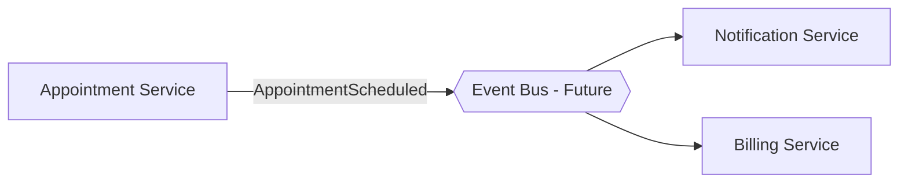

# Hospital Management System — Architecture & Design

---

## 1. Application Architecture

### 1.1 Microservices
**Not used** — Single monolithic Express.js server (`server.js`). Logical service boundaries exist but are not physically separated.

| Domain | Route Prefix |
| :--- | :--- |
| Auth | `POST /api/login` |
| Staff | `/api/doctors` |
| Scheduling | `/api/appointments` |
| Clinical | `/api/medical-records` |
| Billing | `/api/bills` |
| Alerts | `/api/notifications` |

### 1.2 Event-Driven
**Partially present** — No message broker. Notification is triggered synchronously after appointment booking.

```
Patient books → POST /api/appointments → POST /api/notifications → loadAllData()
```



### 1.3 Serverless
**Not used** — Persistent `app.listen()` process with a stateful SQLite connection. Serverless is incompatible with SQLite's file-based locking.

Candidates for serverless if extended: PDF invoice generation, scheduled appointment cleanup, email/SMS dispatch.

---

## 2. Database

### 2.1 ER Diagram

```mermaid
erDiagram
    USERS ||--o{ NOTIFICATIONS : "receives"
    DOCTORS ||--o{ APPOINTMENTS : "assigned to"
    APPOINTMENTS }o..o{ MEDICAL_RECORDS : "soft-link via patientEmail"
    APPOINTMENTS }o..o{ BILLS : "soft-link via patientEmail"

    USERS { string id PK; string email UK; string role; string name }
    DOCTORS { int id PK; string name; string specialty; float rating }
    APPOINTMENTS { int id PK; string patientEmail; int doctorId FK; string status; string date; string time }
    MEDICAL_RECORDS { int id PK; string patientEmail; string diagnosis; text prescription }
    BILLS { int id PK; string patientEmail; float amount; string status }
    NOTIFICATIONS { int id PK; string userId FK; text text; int read }
```

### 2.2 Schema Design

**Engine: SQLite 3** — file-based, zero-config, single writer, appropriate for this scale.

| Table | Key Notes |
| :--- | :--- |
| `users` | UUID PK, roles: `admin\|doctor\|reception\|patient` |
| `doctors` | Separate from `users`; linked to appointments via FK |
| `appointments` | Status: `Scheduled\|Completed\|Cancelled`; `doctorName` denormalized |
| `medical_records` | No FK to `doctors`; linked to patients via `patientEmail` only |
| `bills` | Status: `Pending\|Paid`; no FK to `appointments` |
| `notifications` | FK to `users.id`; `read` flag (0/1) |

**Known trade-offs:**
- No `patients` table — identity inferred from email across tables
- `doctorName` stored in appointments (denormalized) — stale if doctor renamed
- Passwords stored as plain text — must be hashed for production
- Dates stored as `TEXT` (`YYYY-MM-DD`) — no timezone handling

---

## 3. Data Exchange Contract

### 3.1 Frequency

| Trigger | Pattern | Calls Made |
| :--- | :--- | :--- |
| Login | On-demand | 1× POST `/login` |
| Page load / state change | On-demand | 5× parallel GETs (`loadAllData`) |
| Appointment booking | On-demand | POST `/appointments` → POST `/notifications` |
| Bill payment | On-demand | 1× PUT `/bills/:id` |
| Time slots | Once per session | 1× GET `/time-slots` (static) |

No polling, no WebSocket, no real-time push.

### 3.2 Data Sets

**Appointment (POST /api/appointments)**
```json
{ "patientName": "James Anderson", "patientEmail": "patient@mail.com",
  "doctorId": 1, "doctorName": "Dr. Sarah Wilson",
  "date": "2024-03-31", "time": "10:00", "type": "Consultation" }
```

**Medical Record (POST /api/medical-records)**
```json
{ "patientName": "James Anderson", "patientEmail": "patient@mail.com",
  "doctor": "Dr. Sarah Wilson", "date": "2024-03-31",
  "diagnosis": "Elevated BP", "prescription": "Lisinopril 5mg", "symptoms": "Chest discomfort" }
```

**Bill (POST /api/bills)**
```json
{ "patientName": "James Anderson", "patientEmail": "patient@mail.com",
  "amount": 150, "service": "Consultation", "dueDate": "2024-04-07" }
```

### 3.3 Mode of Exchanges

| Mode | Status | Reason |
| :--- | :---: | :--- |
| REST API (JSON/HTTP) | ✅ Used | Only channel — `fetch()` from React to Express |
| Message Queue (AMQP) | ❌ Not used | No broker; notifications are direct sync API calls |
| File Exchange (CSV/PDF) | ❌ Not used | No file endpoints; bills/records are UI-read only |
| WebSocket | ❌ Not used | Low concurrent users; on-action refresh is sufficient |
