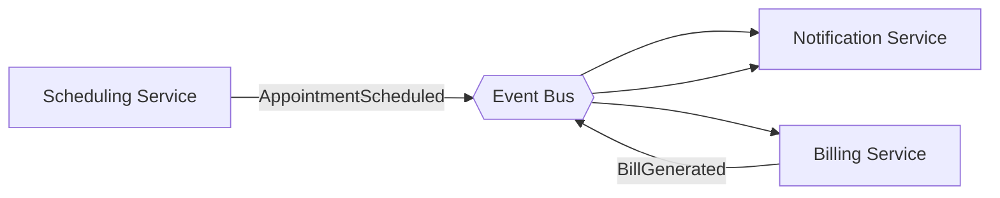
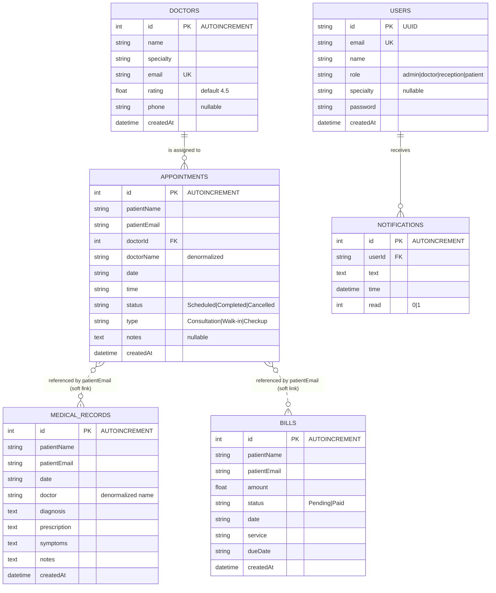

# Hospital Management System (HMS) — Architecture & Design Document

> This document reflects the **actual architecture** of the system as implemented, with honest assessment of each architectural pattern and why it was or was not adopted.

---

## 1. Application Architecture

### 1.1 Microservices

**Verdict: ❌ Not Used — Monolith Chosen Intentionally**

The HMS is built as a **single monolithic application** — one Express.js server (`server.js`) handling all business domains: authentication, doctors, appointments, medical records, billing, and notifications. The React frontend (`index.jsx`) is bundled and served from the same project.

**Why a monolith was the right choice here:**
- The application has a **small, fixed set of users** (Admin, Doctor, Receptionist, Patient) with tightly coupled workflows — a doctor attends a patient whose appointment was booked by reception and billed simultaneously.
- The **data volume is low** (SQLite, a single file database), making distributed services over-engineered and unnecessarily complex to maintain.
- Splitting into microservices would require a service mesh, inter-service networking, and separate deployments — none of which are justified for this scale.

**If the system were to scale** (e.g., deployed across multiple hospitals, thousands of concurrent users), the natural service boundaries would be:

| Domain | Potential Service |
| :--- | :--- |
| `POST /api/login` | Auth Service |
| `/api/doctors` | Staff/Resource Service |
| `/api/appointments` | Scheduling Service |
| `/api/medical-records` | Clinical Records Service |
| `/api/bills` | Billing Service |
| `/api/notifications` | Notification Service |

These boundaries already exist logically in `server.js` — they are just not physically separated yet.

---

### 1.2 Event-Driven Architecture

**Verdict: ⚠️ Partially Present — Informal, In-Process Event Chaining**

A fully asynchronous event-driven architecture (EDA) with a message broker (Kafka, RabbitMQ) is **not used**. However, the application does exhibit a **lightweight, synchronous form of event chaining**:

When a patient books an appointment (`POST /api/appointments`), the frontend immediately fires a second request to create a notification (`POST /api/notifications`) in the same call chain (`addAppointment` function in `index.jsx`, lines 160–165). Both state updates happen synchronously back-to-back.

```
Patient books appointment
    → REST POST /api/appointments  (returns new booking)
    → REST POST /api/notifications  (logs "New booking: ...")
    → loadAllData() refreshes all UI state
```

**Why full EDA wasn't adopted:**
- Full EDA requires a message broker process, consumer workers, and retry/DLQ infrastructure — all of which would triple the operational complexity of a project that currently runs with `node server.js`.
- The notification use case here is simple (in-app only, no email/SMS) and does not require decoupling.

**Where EDA would genuinely add value** if the system grows:
- Patient receives an SMS/email confirmation → Notification Service should subscribe to an `AppointmentScheduled` event asynchronously, so a transient email gateway failure doesn't roll back the booking.
- Billing auto-generation → `AppointmentCompleted` event could trigger the Billing Service to draft an invoice without reception manually clicking "Generate Invoice".



---

### 1.3 Serverless

**Verdict: ❌ Not Used — Traditional Server Process is Appropriate**

The backend runs as a **persistent Node.js process** (`app.listen(PORT, ...)`). Serverless (AWS Lambda, Azure Functions, etc.) is not used.

**Why serverless was not chosen:**
- The server maintains a **persistent SQLite connection** (`const db = new sqlite3.Database(...)`). SQLite is a file-based, embedded database — it cannot be accessed from multiple serverless function instances simultaneously. Serverless is fundamentally incompatible with this database choice.
- The application handles **real-time request/response cycles** with low latency expectations. The cold-start delay of serverless functions would degrade user experience for appointment booking and login.
- All HTTP routes are tightly coupled to the same DB instance. Fragmenting them across Lambda cold-start-prone handlers adds complexity with no benefit.

**Specific tasks that *would* genuinely benefit from serverless** if this system were extended:
- **PDF Invoice Generator**: On-demand, triggered when reception clicks "Generate Invoice" — stateless, short-lived, no DB persistence needed.
- **Scheduled Appointment Cleanup**: A cron-triggered function (e.g., AWS EventBridge + Lambda) that marks past `Scheduled` appointments as `Completed` or `No-Show` — currently no such mechanism exists.
- **Email/SMS Dispatch**: Sending confirmation emails via SendGrid/Twilio — pure I/O tasks, perfectly suited for stateless serverless execution.

---

## 2. Database

### 2.1 ER Diagram

The following diagram reflects the **actual tables and relationships** as defined in `server.js` (`initializeDatabase()`).

> **Important note on referential integrity**: The `appointments` table has a `FOREIGN KEY (doctorId) REFERENCES doctors(id)`, but `medical_records` and `bills` link to patients only via email string — there is no `patients` table. Patient identity is derived from appointment and record data, not from a dedicated entity.



---

### 2.2 Schema Design

**Database Engine: SQLite 3** — chosen because:
- The application is a **single-server deployment** with one active writer at a time. SQLite's file-based locking is sufficient.
- Zero-configuration, no separate database server process needed. Reduces operational overhead for a project of this scope.
- Appropriate for development and small-to-medium clinic deployments (under a few thousand records).

#### Design Notes & Trade-offs

| Issue | Detail |
| :--- | :--- |
| **No `patients` table** | Patient identity is inferred from `patientEmail` across `appointments`, `medical_records`, and `bills`. This is a denormalization — acceptable for this scale but limits patient management features. |
| **`doctorName` denormalized in `appointments`** | Doctor name is stored directly in the appointment row. If a doctor updates their name, historical appointments won't reflect it. This is a deliberate trade-off for simpler reads. |
| **`doctor` in `medical_records` is a plain string** | Not a foreign key to `doctors` table. Reduces schema strictness but avoids cascading issues when doctors are removed. |
| **`password` stored as plain text** | Default is `'password123'`. This is a **critical security gap** for production. Passwords must be hashed (bcrypt). |
| **Date fields stored as `TEXT`** | SQLite has no native Date type. Dates are stored as ISO strings (`YYYY-MM-DD`). Sorting works because of the format, but timezone handling is absent. |

#### Full Schema

```sql
-- Users (system accounts for all roles)
CREATE TABLE IF NOT EXISTS users (
  id       TEXT     PRIMARY KEY,        -- UUID
  email    TEXT     UNIQUE NOT NULL,
  name     TEXT     NOT NULL,
  role     TEXT     NOT NULL,           -- admin | doctor | reception | patient
  specialty TEXT,                       -- for doctor role only
  password TEXT     DEFAULT 'password123',
  createdAt DATETIME DEFAULT CURRENT_TIMESTAMP
);

-- Doctors (clinical staff directory)
CREATE TABLE IF NOT EXISTS doctors (
  id        INTEGER  PRIMARY KEY AUTOINCREMENT,
  name      TEXT     NOT NULL,
  specialty TEXT     NOT NULL,
  email     TEXT     UNIQUE NOT NULL,
  rating    REAL     DEFAULT 4.5,
  phone     TEXT,
  createdAt DATETIME DEFAULT CURRENT_TIMESTAMP
);

-- Appointments (scheduling)
CREATE TABLE IF NOT EXISTS appointments (
  id           INTEGER  PRIMARY KEY AUTOINCREMENT,
  patientName  TEXT     NOT NULL,
  patientEmail TEXT     NOT NULL,
  doctorId     INTEGER  NOT NULL REFERENCES doctors(id),
  doctorName   TEXT     NOT NULL,   -- denormalized for read performance
  date         TEXT     NOT NULL,   -- YYYY-MM-DD
  time         TEXT     NOT NULL,   -- HH:MM
  status       TEXT     DEFAULT 'Scheduled',  -- Scheduled | Completed | Cancelled
  type         TEXT,                -- Walk-in | Consultation | Checkup
  notes        TEXT,
  createdAt    DATETIME DEFAULT CURRENT_TIMESTAMP
);

-- Medical Records (clinical notes)
CREATE TABLE IF NOT EXISTS medical_records (
  id           INTEGER  PRIMARY KEY AUTOINCREMENT,
  patientName  TEXT     NOT NULL,
  patientEmail TEXT     NOT NULL,
  date         TEXT     NOT NULL,
  doctor       TEXT     NOT NULL,   -- denormalized doctor name
  diagnosis    TEXT     NOT NULL,
  prescription TEXT     NOT NULL,
  symptoms     TEXT,
  notes        TEXT,
  createdAt    DATETIME DEFAULT CURRENT_TIMESTAMP
);

-- Bills (invoicing)
CREATE TABLE IF NOT EXISTS bills (
  id           INTEGER  PRIMARY KEY AUTOINCREMENT,
  patientName  TEXT     NOT NULL,
  patientEmail TEXT     NOT NULL,
  amount       REAL     NOT NULL,
  status       TEXT     DEFAULT 'Pending',  -- Pending | Paid
  date         TEXT     NOT NULL,
  service      TEXT     NOT NULL,
  dueDate      TEXT,
  createdAt    DATETIME DEFAULT CURRENT_TIMESTAMP
);

-- Notifications (in-app alerts)
CREATE TABLE IF NOT EXISTS notifications (
  id     INTEGER  PRIMARY KEY AUTOINCREMENT,
  userId TEXT     NOT NULL REFERENCES users(id),
  text   TEXT     NOT NULL,
  time   DATETIME DEFAULT CURRENT_TIMESTAMP,
  read   INTEGER  DEFAULT 0   -- 0 = unread, 1 = read
);
```

---

## 3. Data Exchange Contract

### 3.1 Frequency of Data Exchanges

| Operation | Trigger | Frequency |
| :--- | :--- | :--- |
| Login | User clicks role card | **On-demand** (user-initiated, single call) |
| Load all data | After login or any mutation | **On-demand** — `loadAllData()` is called whenever state changes. Makes 5 parallel GET requests simultaneously. |
| Book appointment | Reception/Patient submits form | **On-demand** — POST + immediate GET refresh |
| Notification creation | After every appointment booking | **Piggy-backed** on appointment booking, fires immediately after |
| Bill status update | Reception marks as paid | **On-demand** — single PUT request |
| Time slots | After login | **Once per session** — static list from server, does not change |

**There is no polling, no WebSocket, and no real-time push** in the current system. The UI reflects the server state only at the moment of the last `loadAllData()` call. Two receptionists booking appointments simultaneously could see stale data until they trigger a refresh action.

---

### 3.2 Data Sets

All data exchanged between the frontend and backend is **JSON over HTTP**. Below are the actual request and response shapes used in production.

#### Appointment Booking Request
`POST /api/appointments`
```json
{
  "patientName": "James Anderson",
  "patientEmail": "patient@mail.com",
  "doctorId": 1,
  "doctorName": "Dr. Sarah Wilson",
  "date": "2024-03-31",
  "time": "10:00",
  "type": "Consultation"
}
```

#### Appointment Response (from server)
```json
{
  "id": 3,
  "patientName": "James Anderson",
  "patientEmail": "patient@mail.com",
  "doctorId": 1,
  "doctorName": "Dr. Sarah Wilson",
  "date": "2024-03-31",
  "time": "10:00",
  "status": "Scheduled",
  "type": "Consultation"
}
```

#### Medical Record Request
`POST /api/medical-records`
```json
{
  "patientName": "James Anderson",
  "patientEmail": "patient@mail.com",
  "date": "2024-03-31",
  "doctor": "Dr. Sarah Wilson",
  "diagnosis": "Normal sinus rhythm, slightly elevated BP",
  "prescription": "Lisinopril 5mg daily",
  "symptoms": "Chest discomfort",
  "notes": ""
}
```

#### Notification Payload
`POST /api/notifications`
```json
{
  "userId": "uuid-of-logged-in-user",
  "text": "New booking: James Anderson with Dr. Sarah Wilson"
}
```

#### Bill Generation Request
`POST /api/bills`
```json
{
  "patientName": "James Anderson",
  "patientEmail": "patient@mail.com",
  "amount": 150,
  "service": "Consultation",
  "dueDate": "2024-04-07"
}
```

---

### 3.3 Mode of Exchanges

| Mode | Used? | Why |
| :--- | :---: | :--- |
| **REST API (JSON/HTTPS)** | ✅ Yes | The only communication channel. The React frontend calls `fetch()` against `http://localhost:5055/api/...`. Simple, stateless, well-understood, and sufficient for the current load. |
| **Message Queue (AMQP/Kafka)** | ❌ No | No message broker is provisioned. The notification "event" is a direct synchronous API call, not a queue. Adding a queue would require running a separate broker process, which adds operational overhead not warranted by the scale. |
| **File Exchange (CSV/PDF)** | ❌ No | No file upload or download endpoints exist. Bills and records are read from the UI only. A PDF export would be a natural future addition (e.g., generating invoices). |
| **WebSocket** | ❌ No | No real-time push is implemented. Given the current single-clinic use case with low concurrent users, polling on action is acceptable. WebSocket would be needed if the system needed to reflect concurrent updates to multiple desks (e.g., two receptionists sharing a booking view). |

#### API Endpoint Summary

| Method | Endpoint | Consumer | Purpose |
| :--- | :--- | :--- | :--- |
| `POST` | `/api/login` | Frontend | Authenticate user by email |
| `GET` | `/api/doctors` | Frontend | Fetch all doctors |
| `POST` | `/api/doctors` | Admin | Add a new doctor |
| `PUT` | `/api/doctors/:id` | Admin | Update doctor details |
| `DELETE` | `/api/doctors/:id` | Admin | Remove a doctor |
| `GET` | `/api/appointments` | Frontend | Get all or filtered appointments |
| `POST` | `/api/appointments` | Reception/Patient | Book an appointment |
| `PUT` | `/api/appointments/:id` | Reception/Doctor | Update appointment status |
| `DELETE` | `/api/appointments/:id` | Admin | Cancel appointment record |
| `GET` | `/api/medical-records` | Doctor/Patient | Fetch clinical records |
| `POST` | `/api/medical-records` | Doctor | Add a diagnosis and prescription |
| `DELETE` | `/api/medical-records/:id` | Admin | Remove a medical record |
| `GET` | `/api/bills` | Reception | Fetch all or patient bills |
| `POST` | `/api/bills` | Reception | Generate an invoice |
| `PUT` | `/api/bills/:id` | Reception | Mark a bill as paid |
| `DELETE` | `/api/bills/:id` | Admin | Remove a bill record |
| `GET` | `/api/notifications` | Frontend | Fetch notifications by userId |
| `POST` | `/api/notifications` | Frontend | Create a notification |
| `GET` | `/api/time-slots` | Frontend | Fetch available booking times |
